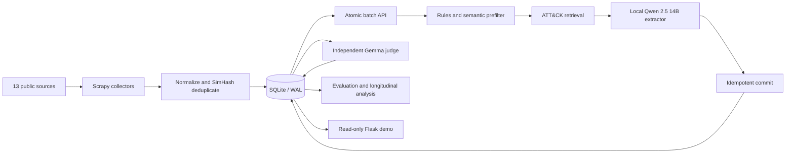

# Ransomware Intelligence Pipeline

[](https://github.com/SalvaCB-git/ransomware-intelligence-pipeline/actions/workflows/ci.yml)
[](https://scraper.143.47.55.55.sslip.io/demo)

An end-to-end cyber threat intelligence pipeline that collects public ransomware
reporting, extracts MITRE ATT&CK techniques with a local LLM and retrieval, and
validates the resulting intelligence with an independent model and human
calibration.

Built by **Salvador Cascón Bertomeu** as a 2026 Computer Engineering capstone.
The system combines data engineering, applied AI, statistical evaluation,
backend development and security-conscious deployment.

**[Open the read-only demo](https://scraper.143.47.55.55.sslip.io/demo)** ·
**[Reproduce the results](#reproduce-the-headline-results)** ·
**[Read the original Spanish documentation](README.es.md)**

## Why this project

Mapping unstructured threat reporting to ATT&CK is useful for analysis, but LLM
output cannot be treated as ground truth. This project therefore treats
extraction and validation as separate stages and records the evidence needed to
measure their agreement, failure modes and practical limits.

The deployed pipeline:

- collects and normalizes reporting from 13 public sources;
- deduplicates 3,871 articles with SimHash and persists them in SQLite/WAL;
- prefilters articles with deterministic rules and semantic retrieval;
- uses Qwen 2.5 14B locally with RAG over 691 ATT&CK entries;
- validates candidate techniques with an independent Gemma model;
- exposes a Flask API and a public read-only analysis interface;
- reproduces its headline metrics from a versioned, privacy-conscious snapshot.

## System overview



The always-on server runs on an OCI ARM instance. GPU-intensive extraction runs
on a local Linux workstation through authenticated, idempotent batch endpoints.
This split keeps the public service available without requiring a permanently
running GPU.

## Headline results

| Measure | Result | Evaluation set | What it establishes |
| --- | ---: | ---: | --- |
| End-to-end F1 | **0.726** | N=377 | Central post-hoc estimate for the complete validation pipeline. |
| Matthews correlation coefficient | **0.577** | N=377 | Performance accounting for class imbalance. |
| Krippendorff's alpha | **0.6461** | N=278 | Moderate human/model agreement; 95% interval `[0.5439, 0.7490]`. |
| Structured JSON adherence | **96.34%** | Full evaluated output | Reliability of the extractor's machine-readable format. |
| Vague-abstraction error correction | **96.9%** | E1 errors from judge v1 | Share corrected by the independent v2 judge. |

Human calibration accepted 41.0% of confidence-1.0 candidates (`N=100`), while
the Gemma judge accepted 41.27% (`N=4,437`). These samples are nested rather
than independent; the result does **not** establish equivalence within ±5
percentage points. Different evaluation stages also use different sample sizes,
so their metrics should not be compared as if they came from one common test
set.

See [DEFENSA_OBJETIVOS_CONTRATO.md](DEFENSA_OBJETIVOS_CONTRATO.md) for the
metric-to-artifact traceability used in the academic evaluation.

## Reliability and reproducibility

The repository includes `data/ransomware_intel.db`, a canonical snapshot with
article bodies removed. It retains the metadata and derived tables required to
reproduce the published figures without redistributing third-party full text.

The implementation uses:

- atomic acquisition and commit endpoints with expiring batch locks;
- idempotent writes for extraction and judge results;
- deterministic unit tests for normalization, deduplication, prefiltering,
  ATT&CK lookup and spider discovery;
- an independent statistical validation suite against scikit-learn, SciPy,
  statsmodels and NetworkX;
- explicit caveats for missing data, corpus bias, catalog lag and unreliable
  publication dates.

## Run the system

### Server

Prerequisites: Docker, Docker Compose and an external Docker network named
`monitor_net`.

```bash
cp .env.example .env
# Fill GOOGLE_API_KEY, BASIC_AUTH_USER and BASIC_AUTH_PASS in .env

docker network create monitor_net
docker compose up -d
docker logs -f scraper
```

Flask binds to `127.0.0.1:7000` on the host. The reference deployment places
NGINX Proxy Manager in front of it for TLS termination and reverse proxying.

### Local extraction client

Prerequisites: Python 3.10+, Ollama, the
`qwen2.5:14b-instruct-q4_K_M` model and an NVIDIA GPU with at least 12 GB VRAM.

```bash
cd pc
python3 -m venv venv
source venv/bin/activate
pip install -r requirements.txt
cp .env.example .env

python3 build_index.py
python3 run_extraction.py --batch-size 50
```

The complete client configuration and operating notes are in
[pc/README.md](pc/README.md).

## Reproduce the headline results

Create a separate analysis environment:

```bash
python3 -m venv .venv-analysis
source .venv-analysis/bin/activate
pip install -r requirements-analysis.txt
```

| Result | Command | Generated artifact |
| --- | --- | --- |
| F1, MCC and classification metrics | `python evaluation_f1.py` | `outputs/evaluation_f1/primary_metrics.csv` |
| Krippendorff's alpha | `python krippendorff_segmented.py` | `outputs/krippendorff_segmented/headline.csv` |
| 2021–2025 longitudinal analysis | `python longitudinal_analysis.py --csv-dir outputs/longitudinal` | `outputs/longitudinal/` |
| Co-occurrence and centrality | `python cooccurrence_analysis.py` | `outputs/cooccurrence/` |
| JSON adherence | `python json_adherence.py` | `outputs/json_adherence/` |
| ATT&CK catalog lag | `python mitre_catalog_lag.py` | `outputs/catalog_lag/catalog_lag_strict.csv` |

`mitre_catalog_lag.py` downloads historical ATT&CK STIX bundles on its first
run. Other headline analyses use the included snapshot.

## Tests

The core suite is deterministic and does not require network access, a database
service or a GPU:

```bash
python3 -m venv .venv-dev
.venv-dev/bin/pip install -r requirements-dev.txt
.venv-dev/bin/pytest tests/ --ignore=tests/test_analysis_vs_reference.py -q
# 22 passed
```

The statistical implementations have a separate reference-validation suite:

```bash
python3 -m venv .venv-validation
.venv-validation/bin/pip install pytest -r requirements-validation.txt
.venv-validation/bin/pytest tests/test_analysis_vs_reference.py -q
# 13 passed
```

CI executes both suites independently. See [tests/README.md](tests/README.md)
for scope and known exclusions.

## Security and privacy

- Public pages and their read-only JSON endpoints are intentionally accessible
  without credentials.
- Mutation and client/server pipeline endpoints require HTTP Basic
  authentication using secrets injected through environment variables.
- Credential comparison uses `hmac.compare_digest`.
- Flask is bound to loopback behind the TLS reverse proxy.
- Article bodies are excluded from the distributed database snapshot.
- Secrets, local environments and generated outputs are excluded from version
  control.

The current deployment uses one authentication layer at the Flask boundary.
Distinct reverse-proxy and application credentials remain planned defense in
depth. Please read [SECURITY.md](SECURITY.md) before testing the live service.

## Responsible collection and data limits

The crawler targets public threat-research material and honors `robots.txt` by
default. The complete source-specific policy, exceptions and legal rationale are
documented in [the Spanish technical guide](README.es.md). No access controls or
paywalls are bypassed, and third-party article bodies are not redistributed in
the repository.

Known data limitations include:

- true recall cannot be estimated from the candidate-only validation sample;
- human calibration used one primary annotator;
- source and temporal coverage are uneven;
- CrowdStrike publication dates are unreliable and excluded from temporal
  analyses;
- retrospective ATT&CK mapping may be affected by catalog timing;
- SQLite is appropriate for this deployment size, not unlimited growth;
- API error contracts and defense in depth require further hardening.

## Repository map

```text
.
├── app.py                         # Flask UI, API and authentication
├── judge_core.py                  # Shared independent-judge logic
├── judge_v2.py                    # Offline validation CLI
├── docker-compose.yml             # Server deployment
├── scrapy_project/                # Collection and preprocessing
├── pc/                            # Local GPU extraction client
├── data/                          # Reproducible snapshot and ATT&CK cache
├── tests/                         # Core and statistical validation tests
├── benchmark_v2_results/          # Raw extractor benchmark artifacts
├── evaluation_f1.py               # Primary evaluation
├── krippendorff_segmented.py      # Agreement analysis
├── longitudinal_analysis.py       # Temporal analysis
└── cooccurrence_analysis.py       # Association and graph analysis
```

## Further documentation

- [Spanish technical guide](README.es.md)
- [Objective and evidence traceability](DEFENSA_OBJETIVOS_CONTRATO.md)
- [Local extraction pipeline](pc/README.md)
- [Collectors and schemas](scrapy_project/README.md)
- [Test design and exclusions](tests/README.md)
- [Dataset contents and caveats](data/README.md)
- [Extractor benchmark artifacts](benchmark_v2_results/README.md)

## License and attribution

The repository currently has no formal open-source license. The code is
publicly viewable, but reuse requires the author's permission until a license is
selected. Data and third-party resources may have separate terms.

MITRE ATT&CK® material is reproduced with permission of The MITRE Corporation.
MITRE ATT&CK® is a registered trademark of The MITRE Corporation.
